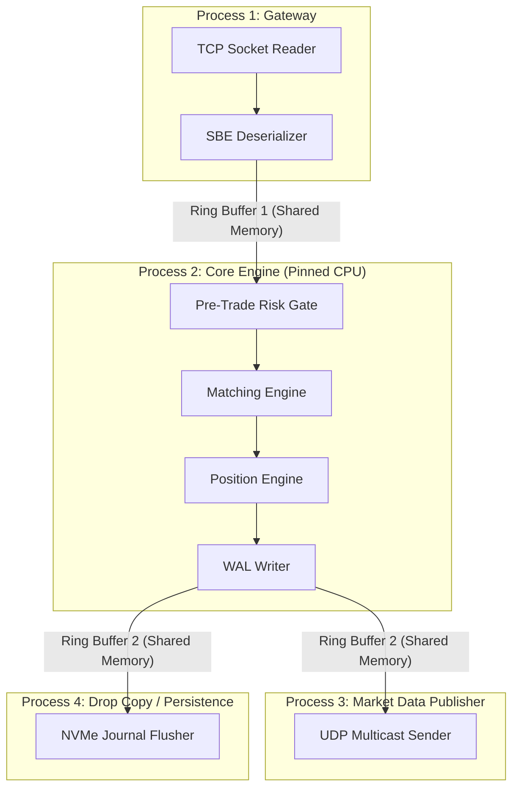

# NEXUS_ARCH.md : The Blueprint

This document defines the target architecture for Nexus Core—the production-grade system that replaces the current prototype. It specifies the Binary Message Schema, the Inter-Process Communication (IPC) strategy, the Write-Ahead Log (WAL), and the safety features required by the Nexus Standard.

---

## 1. Binary Message Schema (SBE Wire Structs)

All messages on the hot path are packed binary structs. No JSON. No string parsing. The Gateway reads raw bytes from the socket and casts them directly to the struct pointer.

### 1.1 Common Header (8 bytes)
Every message begins with this header.
```
Offset | Size | Field         | Type   | Description
-------|------|---------------|--------|---------------------------
0      | 2    | msg_length    | u16    | Total message length (bytes)
2      | 1    | msg_type      | u8     | Message type enum
3      | 1    | version       | u8     | Schema version (for compat)
4      | 4    | sequence_num  | u32    | Monotonic sequence number
```

### 1.2 NewOrderSingle (32 bytes total)
```
Offset | Size | Field           | Type   | Description
-------|------|-----------------|--------|---------------------------
0      | 8    | header          | Header | Common header (msg_type = 0x01)
8      | 4    | trader_id       | u32    | Numeric trader identifier
12     | 8    | client_order_id | u64    | Client-assigned correlation ID
20     | 4    | price           | i64    | Fixed-point price (value × 10^8)
28     | 4    | quantity         | u32    | Order quantity
32     | 1    | side            | u8     | 1 = Buy, 2 = Sell
33     | 1    | order_type      | u8     | 1 = Limit, 2 = Market
34     | 1    | time_in_force   | u8     | 1 = GTC, 2 = IOC, 3 = FOK
35     | 1    | _padding        | u8     | Alignment padding
```
**Total: 36 bytes.** Compare to the current JSON `place_order` message which averages ~120 bytes of UTF-8 text.

### 1.3 CancelOrderSingle (20 bytes total)
```
Offset | Size | Field           | Type   | Description
-------|------|-----------------|--------|-----------------------------
0      | 8    | header          | Header | Common header (msg_type = 0x02)
8      | 4    | trader_id       | u32    | Trader requesting cancel
12     | 8    | target_order_id | u64    | Order to cancel
```

### 1.4 ExecutionReport (48 bytes total)
Sent from the engine back to the client confirming a fill, accept, or reject.
```
Offset | Size | Field           | Type   | Description
-------|------|-----------------|--------|-----------------------------
0      | 8    | header          | Header | Common header (msg_type = 0x10)
8      | 4    | trader_id       | u32    | Recipient trader
12     | 8    | order_id        | u64    | Exchange-assigned order ID
20     | 8    | client_order_id | u64    | Echoed client correlation ID
28     | 1    | exec_type       | u8     | 0=New, 1=Fill, 2=PartialFill, 3=Cancel, 4=Reject
29     | 1    | side            | u8     | Side echo
30     | 2    | _padding        | u16    | Alignment
32     | 8    | exec_price      | i64    | Fill price (fixed-point)
40     | 4    | exec_qty        | u32    | Fill quantity
44     | 4    | leaves_qty      | u32    | Remaining quantity
```

### 1.5 MarketDataBBO (40 bytes total)
Broadcast via UDP Multicast.
```
Offset | Size | Field         | Type   | Description
-------|------|---------------|--------|---------------------------
0      | 8    | header        | Header | Common header (msg_type = 0x20)
8      | 8    | timestamp_ns  | u64    | Exchange nanosecond clock
16     | 8    | best_bid_px   | i64    | Best bid price (fixed-point)
24     | 4    | best_bid_sz   | u32    | Best bid total size
28     | 8    | best_ask_px   | i64    | Best ask price (fixed-point)
36     | 4    | best_ask_sz   | u32    | Best ask total size
```

---

## 2. Inter-Process Communication (IPC) Strategy

The Nexus engine is split into isolated processes/threads communicating over shared memory ring buffers. No TCP between internal components.



### 2.1 Ring Buffer Specification
- **Type:** Single-Producer Single-Consumer (SPSC) bounded circular buffer.
- **Size:** 2^20 slots (1,048,576 entries). Each slot is 64 bytes (one cache line).
- **Memory:** `mmap`-backed anonymous shared memory. Pre-allocated at startup.
- **Synchronization:** Lock-free via atomic `head` and `tail` counters with `Acquire/Release` memory ordering.
- **Backpressure:** If the consumer falls behind and the buffer is full, the producer spins (busy-wait). No blocking syscalls.

### 2.2 Why Not TCP Between Components?
TCP between internal Nexus components would require:
1. Kernel context switch for every `send()` / `recv()` (~1,500ns each).
2. TCP framing overhead (20-byte headers).
3. Nagle's algorithm buffering (must be disabled with `TCP_NODELAY`).
4. Socket buffer copies (user-space → kernel → user-space).

Shared memory ring buffers avoid all of this. The producer writes directly to a memory address that the consumer reads. **Zero copies. Zero syscalls. Zero kernel involvement.**

---

## 3. The Write-Ahead Log (WAL) — Deterministic State Recovery

Every message that enters Ring Buffer 1 (inbound) and every event that exits Ring Buffer 2 (outbound) is sequentially appended to a Write-Ahead Log on NVMe storage.

### 3.1 WAL Entry Format
```
[8 bytes: sequence_number] [4 bytes: payload_length] [N bytes: raw SBE message] [4 bytes: CRC32 checksum]
```

### 3.2 Recovery Procedure
On startup, if a WAL file exists:
1. Read and verify every entry via CRC32.
2. Replay inbound messages sequentially through the Risk Gate → Matching Engine → Position Engine.
3. Because the engine is 100% deterministic, the resulting state (Order Book, Balances, PnL) will be **byte-identical** to the state at the moment of the crash.

---

## 4. Safety Features 

### 4.1 Cancel-on-Disconnect (CoD)
When the TCP Gateway detects a client socket closure (`EPOLLHUP` / `ECONNRESET`):
1. The Gateway immediately injects a synthetic `CancelAllOrders` message for that `trader_id` into Ring Buffer 1.
2. The Matching Engine processes it deterministically, removing all resting orders for that trader.
3. This prevents orphaned orders from causing uncontrolled risk exposure.

### 4.2 Fat-Finger Protection
Before the Pre-Trade Risk Gate forwards an order to the Matching Engine, it checks:
1. **Price Collar:** Order price must be within ±5% of the last trade price (configurable).
2. **Max Order Size:** Order quantity must not exceed a hard cap (e.g., 10,000 lots).
3. **Max Notional:** `price × quantity` must not exceed a per-trader notional limit.
4. **Rate Limiter:** Each `trader_id` is limited to N orders per second (e.g., 1,000 msg/sec). Implemented via a fixed-window token bucket per trader, stored in a contiguous array indexed by `trader_id`.

### 4.3 Kill Switch
A special administrative message (`msg_type = 0xFF`) can be injected to immediately:
1. Halt all matching (engine enters `HALTED` state).
2. Reject all new inbound orders.
3. Optionally cancel all resting orders for all traders.

---

## 5. Component Dependency Graph (What Replaces What)

| Current File | Status | Nexus Replacement |
|-------------|--------|-------------------|
| `models.py` | **REPLACE** | `nexus_core/types/mod.rs` — Fixed-point structs |
| `message_schemas.py` | **DELETE** | `nexus_core/wire/sbe.rs` — Binary codec |
| `orderbook.py` | **REPLACE** | `nexus_core/matching/book.rs` — $O(1)$ array book |
| `engine.py` | **REPLACE** | `nexus_core/matching/engine.rs` — Zero-alloc matcher |
| `exchange_server.py` | **DELETE** | Entirely superseded by the Disruptor pipeline |
| `server.py` | **REPLACE** | `nexus_core/gateway/tcp.rs` — Raw socket gateway |
| `positions.py` | **REPLACE** | `nexus_core/accounting/positions.rs` — Fixed-point PnL |
| `risk_manager.py` | **DELETE** | Merged into `nexus_core/risk/guardian.rs` |
| `margin_risk_manager.py` | **DELETE** | Merged into `nexus_core/risk/guardian.rs` |
| `market_data_server.py` | **REPLACE** | `nexus_core/egress/multicast.rs` — UDP publisher |
| `exporter.py` | **REPLACE** | `nexus_core/persistence/wal.rs` — Write-Ahead Log |

---

## 6. Fixed-Point Arithmetic Standard

**Scale Factor:** `10^8` (8 decimal places of precision).

| Human Price | Fixed-Point `i64` Value |
|-------------|------------------------|
| $100.00 | `10_000_000_000` |
| $99.95 | `9_995_000_000` |
| $0.01 | `1_000_000` |
| $0.00000001 | `1` |

**All arithmetic** (addition, subtraction, multiplication for notional, division for averages) uses integer math. Division results are truncated (floor), never rounded via floating-point.

```rust
/// Multiply price × quantity to get notional (result is in fixed-point).
fn notional(price: i64, qty: u32) -> i64 {
    price * (qty as i64) // No float. No rounding. Exact.
}

/// Weighted average entry price (integer division, truncated).
fn weighted_avg(old_avg: i64, old_qty: u32, new_price: i64, new_qty: u32) -> i64 {
    let total_qty = old_qty as i64 + new_qty as i64;
    if total_qty == 0 { return 0; }
    (old_avg * old_qty as i64 + new_price * new_qty as i64) / total_qty
}
```
